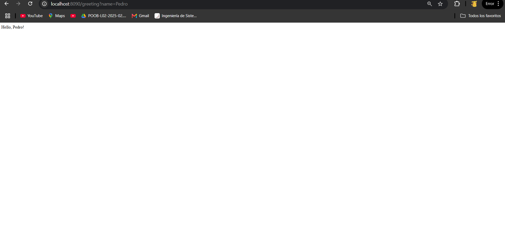
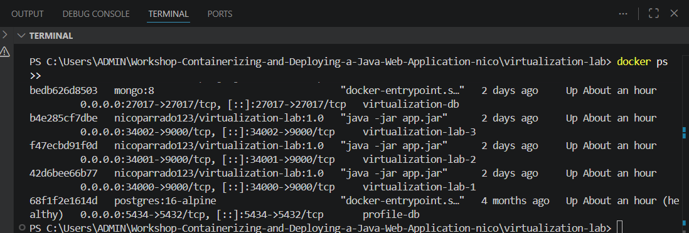
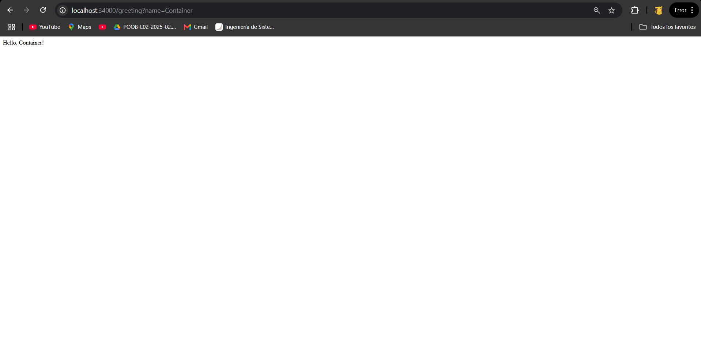
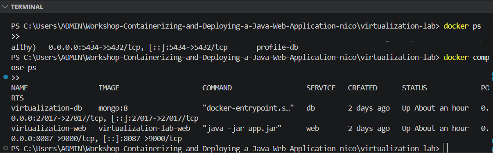
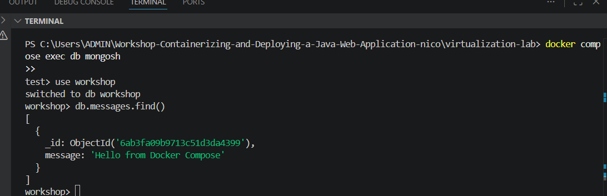
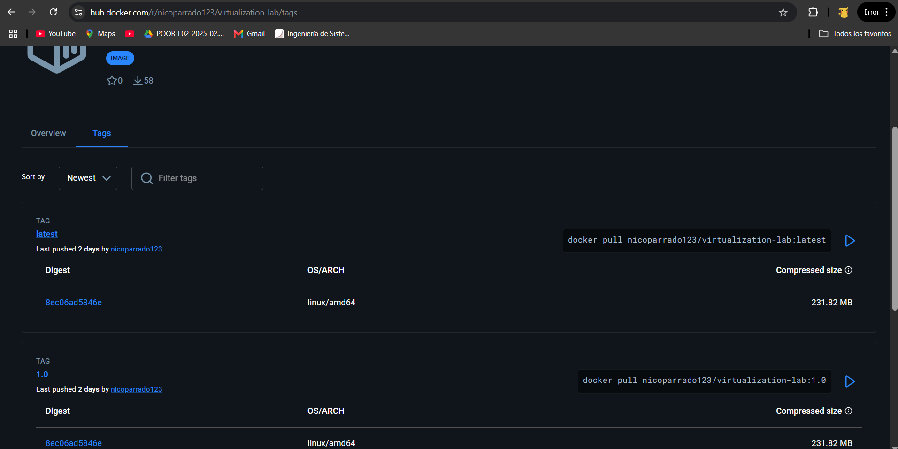
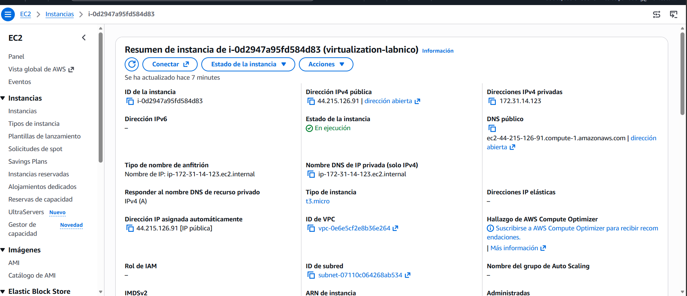
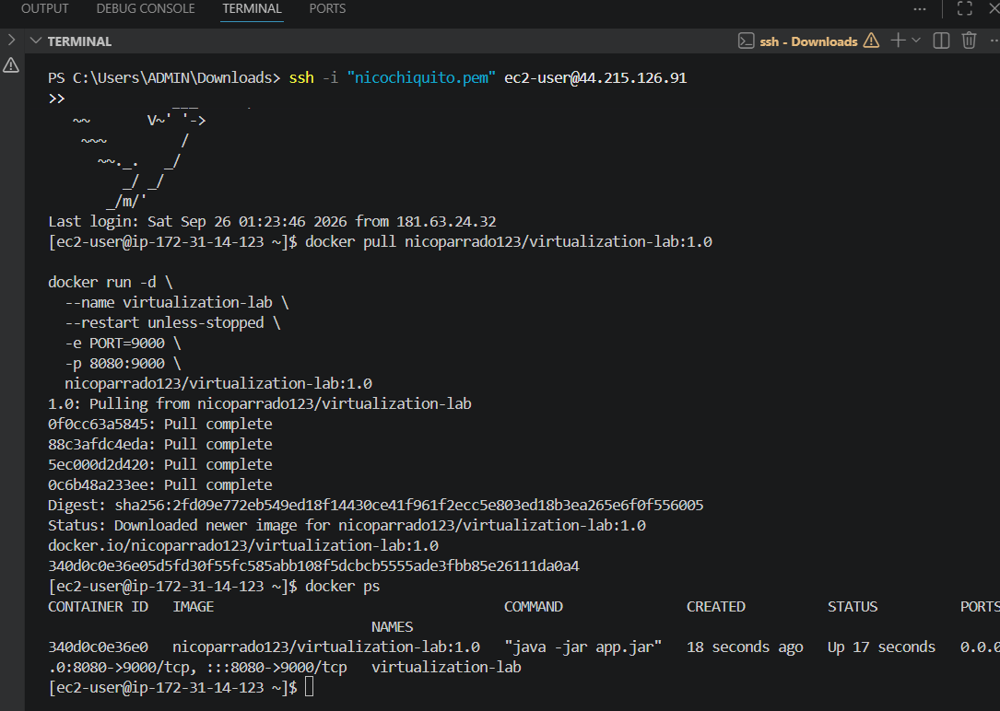
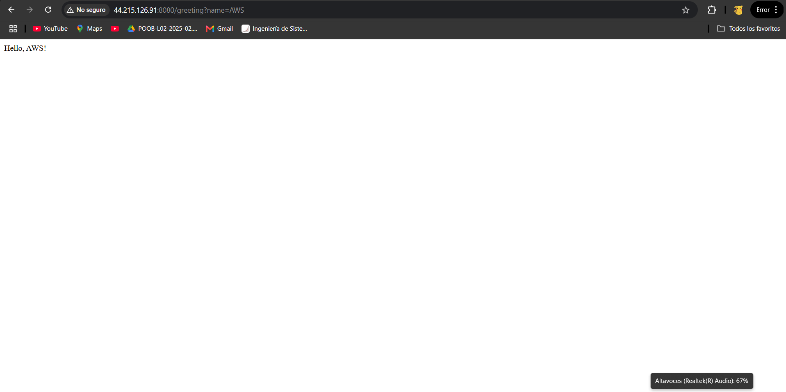

# Taller: Containerización y Despliegue de una Aplicación Web Java

## Descripción

Este taller explora la virtualización como mecanismo de modularidad, aislamiento, portabilidad y despliegue. Se construye una aplicación web Java con Spring Boot, se empaqueta como imagen Docker, se ejecuta localmente en contenedores aislados, se publica en Docker Hub y se despliega en una máquina virtual EC2 de AWS.

---

## Requisitos previos

- Java 21
- Maven 3.9+
- Docker Desktop con Docker Compose v2
- Cuenta en Docker Hub
- Cuenta en AWS con permisos para crear instancias EC2

---

## Parte 1: Aplicación web

### Estructura del proyecto

```
virtualization-lab/
├── src/main/java/co/edu/escuelaing/virtualizationlab/
│   ├── RestServiceApplication.java
│   └── HelloRestController.java
├── Dockerfile
├── compose.yaml
└── pom.xml
```

### Clases principales

**RestServiceApplication.java** — punto de entrada. Lee el puerto desde la variable de entorno `PORT` (por defecto `6000`).

**HelloRestController.java** — expone el endpoint `GET /greeting?name=<valor>`.

### Construir y ejecutar

```bash
mvn clean package
java -jar target/*.jar
```

### Verificar

```
http://localhost:6000/greeting?name=Pedro
```

Respuesta esperada:

```
Hello, Pedro!
```

> **Evidencia:**



---

## Parte 2: Imagen y contenedores Docker

### Dockerfile

```dockerfile
FROM amazoncorretto:21
WORKDIR /app
COPY target/*.jar app.jar
ENV PORT=9000
EXPOSE 9000
ENTRYPOINT ["java", "-jar", "app.jar"]
```

### Construir la imagen

```bash
mvn clean package
docker build -t <dockerhub-user>/virtualization-lab:1.0 .
```

### Ejecutar un contenedor

```bash
docker run -d \
  --name virtualization-lab-1 \
  -e PORT=9000 \
  -p 34000:9000 \
  <dockerhub-user>/virtualization-lab:1.0
```

Verificar: `http://localhost:34000/greeting?name=Container`

### Aislamiento: tres instancias del mismo contenedor

```bash
docker run -d --name virtualization-lab-2 -p 34001:9000 <dockerhub-user>/virtualization-lab:1.0
docker run -d --name virtualization-lab-3 -p 34002:9000 <dockerhub-user>/virtualization-lab:1.0
```

Cada instancia responde de forma independiente en su propio puerto:

| Contenedor             | URL de prueba                                    |
|------------------------|--------------------------------------------------|
| virtualization-lab-1   | http://localhost:34000/greeting?name=Container1  |
| virtualization-lab-2   | http://localhost:34001/greeting?name=Container2  |
| virtualization-lab-3   | http://localhost:34002/greeting?name=Container3  |

> **Evidencia:**






---

## Parte 3: Docker Compose (web + MongoDB)

### compose.yaml

```yaml
services:
  web:
    build:
      context: .
      dockerfile: Dockerfile
    container_name: virtualization-web
    environment:
      PORT: 9000
      SPRING_DATA_MONGODB_URI: mongodb://db:27017/workshop
    ports:
      - "8087:9000"
    depends_on:
      - db

  db:
    image: mongo:8
    container_name: virtualization-db
    volumes:
      - mongodb:/data/db
      - mongodb_config:/data/configdb
    ports:
      - "27017:27017"
    command: mongod

volumes:
  mongodb:
  mongodb_config:
```

### Iniciar los servicios

```bash
docker compose up -d --build
```

### Verificar contenedores y logs

```bash
docker compose ps
docker compose logs web
docker compose logs db
```

### Probar la aplicación

```
http://localhost:8087/greeting?name=Compose
```

### Interactuar con MongoDB

```bash
docker compose exec db mongosh
```

Dentro del shell de MongoDB:

```js
show dbs
use workshop
db.messages.insertOne({ message: "Hello from Docker Compose" })
db.messages.find()
exit
```

### Detener los servicios

```bash
# Detener conservando los volúmenes
docker compose down

# Detener y eliminar los datos
docker compose down -v
```

> **Evidencia:**






---

## Parte 4: Publicar en Docker Hub

```bash
docker login

docker tag <dockerhub-user>/virtualization-lab:1.0 \
  <dockerhub-user>/virtualization-lab:latest

docker push <dockerhub-user>/virtualization-lab:1.0
docker push <dockerhub-user>/virtualization-lab:latest
```

> **Evidencia:**



---

## Parte 5: Despliegue en AWS EC2

### Crear la instancia

- AMI: Amazon Linux 2023
- Grupo de seguridad:
  - Puerto 22 (SSH) solo desde tu IP pública
  - Puerto 8080 solo desde la red que necesita acceso

### Instalar Docker en la instancia

```bash
sudo yum update -y
sudo yum install -y docker
sudo service docker start
sudo usermod -a -G docker ec2-user
```

Cerrar sesión y volver a conectar para que el grupo `docker` tome efecto.

### Ejecutar el contenedor

```bash
docker pull <dockerhub-user>/virtualization-lab:1.0

docker run -d \
  --name virtualization-lab \
  --restart unless-stopped \
  -e PORT=9000 \
  -p 8080:9000 \
  <dockerhub-user>/virtualization-lab:1.0
```

### Verificar

```bash
docker ps
docker logs virtualization-lab
```

```
http://<ec2-public-dns>:8080/greeting?name=AWS
```

Respuesta esperada:

```
Hello, AWS!
```

> **Evidencia:** captura de `docker ps` en EC2 y respuesta del navegador con la DNS pública.

> **Evidencia:**








---

## Parte 6: Modelo de despliegue y análisis de costos

### Arquitectura implementada

```
Cliente
  ↓ HTTP
Máquina virtual EC2
  ↓
Docker Engine
  ↓
Contenedor Java (Spring Boot)
```

### Responsabilidad de cada capa

| Capa | Responsabilidad |
|------|----------------|
| EC2 | Cómputo, memoria, almacenamiento y red rentados por hora |
| Docker | Entorno de ejecución portátil con la aplicación y sus dependencias |
| Aplicación Java | Recibe peticiones HTTP y entrega la lógica de negocio |
| Grupo de seguridad | Controla el tráfico entrante a la máquina virtual |

### Supuestos de carga mensual

| Escenario | Peticiones/mes |
|-----------|---------------|
| Pequeño   | 10,000         |
| Mediano   | 100,000        |
| Grande    | 1,000,000      |

### Estimación de costos (región us-east-1)

Para los tres escenarios una instancia `t3.micro` (2 vCPU, 1 GB RAM) es suficiente. El costo dominante es el tiempo de cómputo, no el volumen de peticiones.

| Recurso | Costo mensual aprox. |
|---------|----------------------|
| EC2 t3.micro (on-demand, 24/7) | ~$8.47 USD |
| Almacenamiento EBS 8 GB gp3 | ~$0.64 USD |
| Transferencia de datos saliente (primeros 100 GB gratis) | $0.00 USD |
| **Total estimado** | **~$9.11 USD/mes** |

Este costo es prácticamente igual para los tres escenarios de carga porque la instancia corre las 24 horas independientemente del número de peticiones. La diferencia aparece solo si se necesita escalar a instancias más grandes o agregar un balanceador de carga.

> Usa la [Calculadora de precios de AWS](https://calculator.aws) para obtener una estimación personalizada.
